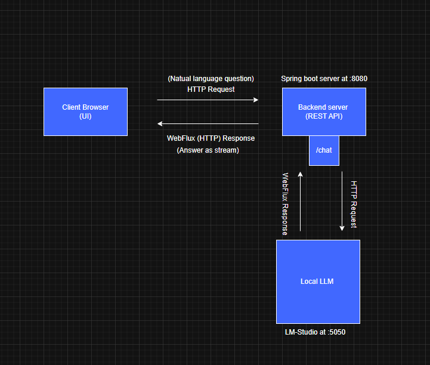
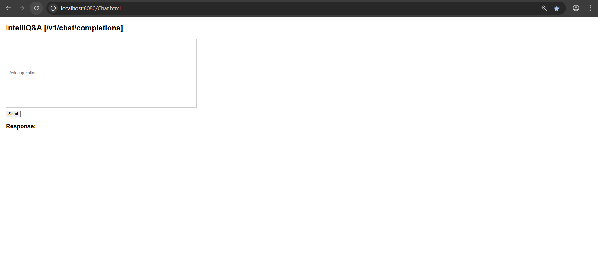

IntelliQA
-------------------
This is an application with an intelligent question-answer system with local LLM. This consists of a Java Spring boot based backend service (REST API) that can answer natural language questions. Backend is  connected to a locally running LLM via LM-Studio.

Architectural diagram
-------------------

Technologies and Tools used
-------------------
Backend: Java Spring Boot, WebFlux

Frontend: Javascript, HTML, CSS

Containerization: Docker

Setup and usage
-------------------
Assuming Docker desktop, Maven, Java (jdk 21) are already installed, follow below steps to run the project.

Open cmd or powershell and then navigate to the root folder of the project.

1. Enter the below commands in order

    1. `mvn clean package` - builds the whole maven package and generates a .jar file under target folder.

    2. `docker build -t intelliqa-app .` - Builds the docker image to generate container.

    3. ` docker run -d -p 8080:8080 intelliqa-app` - Runs the container generated by last command.

    4. `docker ps -a` - To check the status of the container started.

2. Once the container is up and running, open the browser and go to  http://localhost:8080/Chat.html, then you see below simple UI to interact with the backend service and LLM behind it.
 

3. Enter any question here and hit send to see the LLM response in the below window.

4. Swagger package has been added to the pom.xml but there are some issues running it on the browser, hence a simple UI has been added into the source code to allow the user to interact with the API and LLM.

5. If any frontend system needs to be connected to the API, it can be done by using the url `[POST] /chat`